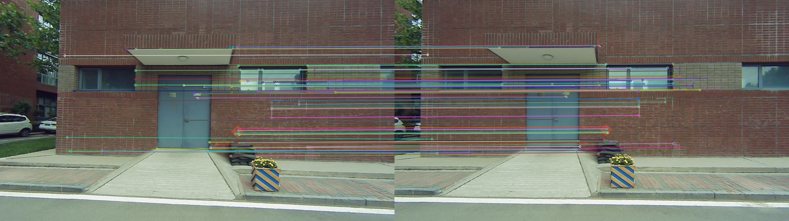
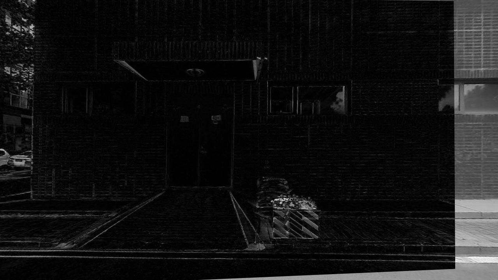

# Image & Lidar Registration

**Introduction**：
This repository extracts surfaces from point clouds and tracks the projected point clouds or corner points in the surface back and forth in two frames for calculating the Homography matrix between them. Besides, update the estimated initail optical flow and the tracking results using the Homography matrix. Repeate until reach convergence or max iteration steps. Then the image data and 3d lidar point can be coupled for providing acurate surfaces models. Test the code in Ubuntu 14.04.

## Prerequisites：

1. PCL

2. opencv

3. Eigen

### Build

```c++
mkdir build  && cd build
cmake ..
make -j4
```

### Run
#### 1. Prepare the dataset.

Collect image as well as 2-axis laser scans. Run the lidar odometry, such as [LeGO-LOAM](https://github.com/RobustFieldAutonomyLab/LeGO-LOAM). Then save the pose graph and the cornerMap point clouds, which contain multiple surfaces after mapping. Next, select frames according to the views and timestamps. The codes also provide time synchronize support for selected sequentail frames. Finally put the files in the data folder.

#### 2. Results on a sample dataset.
```c++
cd build
./plane_tracking2
```
plane corner points matching between two frames (more points than sparse lidar points)


subtract after projection to obtain the surface


#### 3. Other results.

Use the lidar points directly instead of the corner points as the correspondence: fewer points and undesirable tracking results
[matched_lidar_points](support_files/matches_medium.png)

Use one way optical tracking only: the projected lidar points are not stable and result in super poor results  

